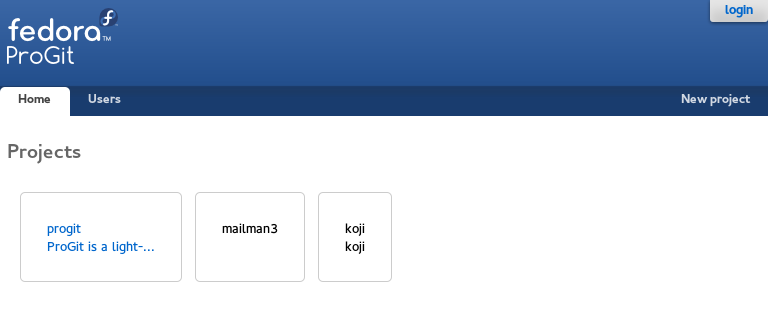
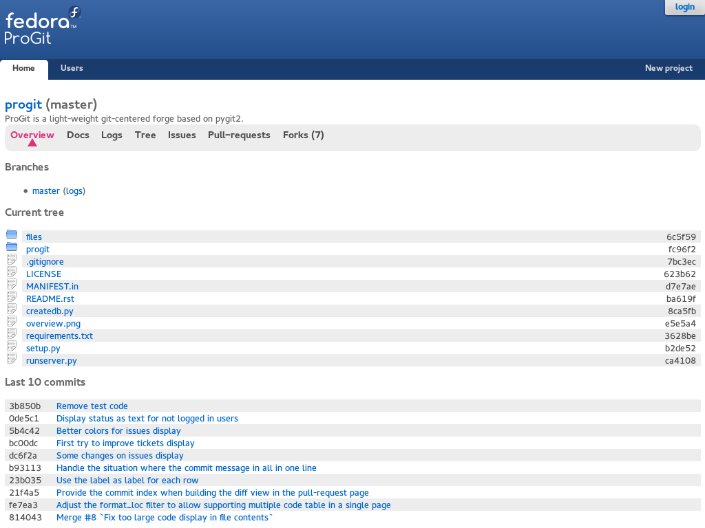
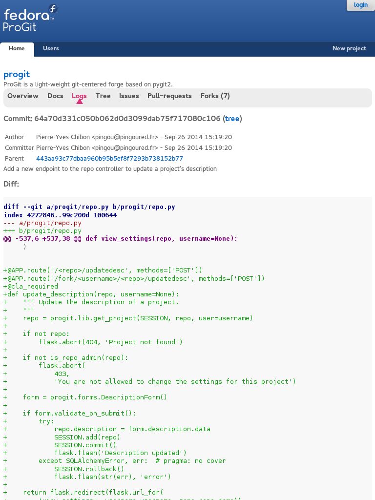
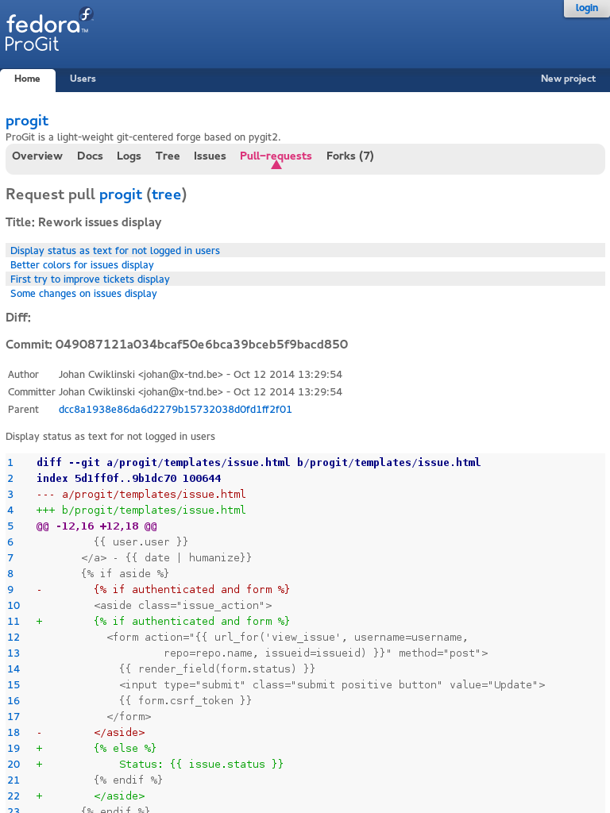
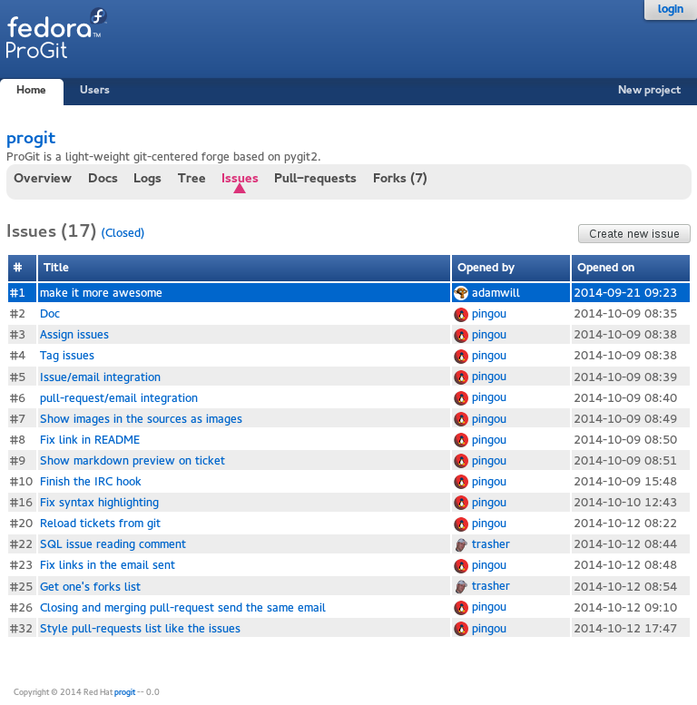
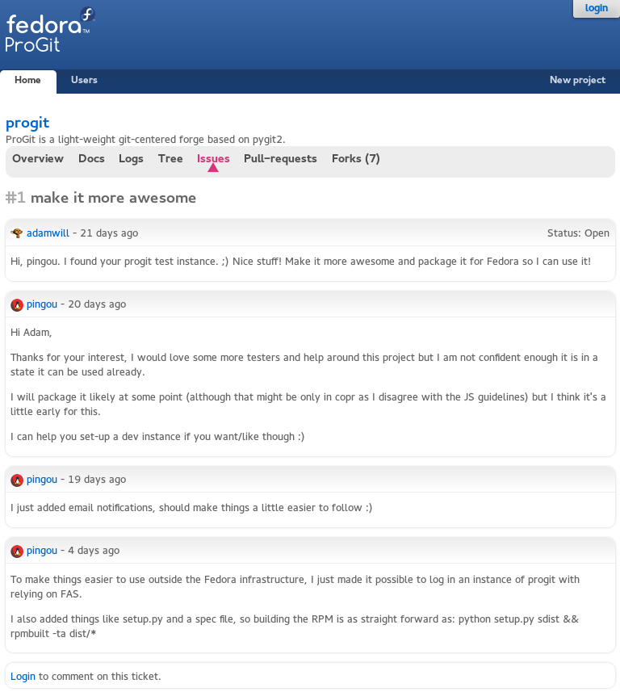
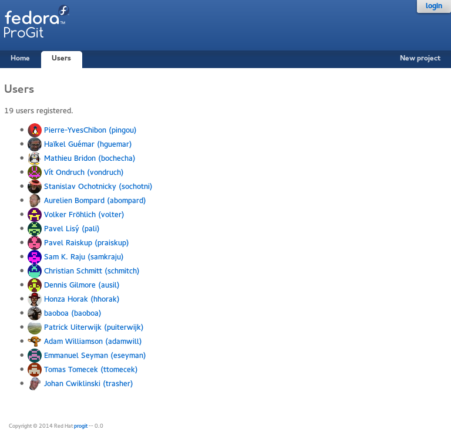

ProGit
======

:Author: Pierre-Yves Chibon <pingou@pingoured.fr>

ProGit is a light-weight git-centered forge based on pygit2.

Currently, ProGit offers a decent web-interface for git repositories, a
simplistic ticket system (that needs improvements) and possibilities to create
new projects, fork existing ones and create/merge pull-requests across or
within projects.

Homepage: https://github.com/pypingou/ProGit

Dev instance: http://209.132.184.222/ (/!\\ May change unexpectedly, it's a dev instance ;-))

Get it running
==============

* Retrieve the sources::

    git clone git://github.com/pypingou/progit

* Create the folder that will receive the projects, forks, docs and tickets'
  git repo::

    mkdir {repos,docs,forks,tickets}

* Run it::

    ./runserver.py

* To get some profiling information you can also run it as::

    ./runserver.py --profile

This will launch the application at http://127.0.0.1:5000

UI overview
-----------

