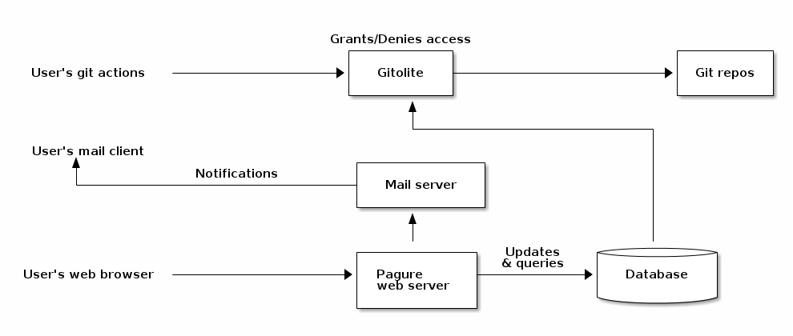
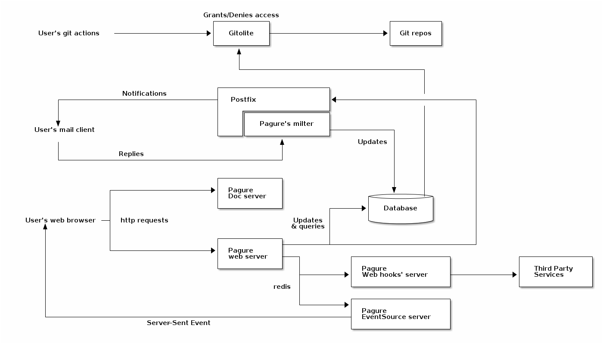

Overview
========

Pagure is split over multiple components, each having their purpose and all
but two (the core web application and its workers) being optional.

These components are:

.. contents::

Before going into the overall picture, one should realize that most of the
components listed above are optional.

Here is a diagram representing pagure without all the optional components:

And here is a diagram of all the components together:

Pagure core application
-----------------------

The core application is the flask application and provide a web UI to
the git repositories as well as tickets and pull-requests.
This is the main application for the forge.

Pagure workers
--------------

Interacting with git repos can be a long process, it varies depending on the
size of the repository itself but also based on hardware performances or
simply the load on the system.
To make pagure capable of handling more load, since pagure 3.0 the interactions
with the git repositories from the web UI is performed by dedicated workers,
allowing async processing of the different tasks.

The communication between the core application and its worker is based on
`celery <http://www.celeryproject.org/>`_ and defaults to using `redis
<https://redis.org>`_ but any of the queueing system supported by `celery
<http://www.celeryproject.org/>`_ could be used instead.

Pagure doc server
-----------------

While integrated into the main application at first, it has been split out
for security concern, displaying information directly provided by the user
without a clear/safe way of filtering for unsafe script or hacks is a
security hole.
For this reason we also strongly encourage anyone wanting to deploy their
own instance of pagure with the doc server, to run this application on a
completely different domain name (not just a sub-domain) in order to reduce
the cross-site forgery risks.

Pagure can be run just fine without the doc server, all you need to do is to
**not** define the variable ``DOC_APP_URL`` in the configuration file.

Pagure milter
-------------

The milter is a script, receiving an email as input and performing an action
with it.

In the case of pagure, the milter is used to allow replying on a comment
of a ticket or a pull-request by directly replying to the notification sent.
No need to go to the page anymore to reply to a comment someone made.

The milter integrates with a MTA such as postfix or sendmail that you will
have running and have access to in order to change its configuration.

Pagure EventSource Server
-------------------------

Eventsource or Server Sent Events are messages sent from a server to a browser.

For pagure this technology is used to allow live-refreshing of a page when
someone is viewing it. For example, while you are reading a ticket if someone
comments on it, the comment will automatically show up on the page without
the need for you to reload the entire page.

The flow is: the main pagure server does an action, sends a message over
redis, the eventsource server picks it up and send it to the browsers waiting
for it, then javascript code is executed to refresh the page based on the
information received.

Pagure web-hook Server
----------------------

Sends notifications to third party services using POST http requests.

This is the second notifications system in pagure with `fedmsg <https://fedmsg.readthedocs.io/>`_.
These notifications are running on their own service to prevent blocking the
main web application in case the third part service is timing-out or just
being slow.

The flow is: the main pagure server does an action, sends a message over
redis, the web-hook server picks it up, build the query and performs the
POST request to the specified URLs.

Pagure load JSON service
------------------------

The load JSON service is an async service updating the database based on
information pushed to the ticket or pull-request git repositories.
This allows updating the database with information pushed to the git
repositories without keeping the connection open with the client.

Pagure log com service
----------------------

The log com (for log commit) service is an async service updating the log
table of the database on every pushed made to any repository allowing to
build the data for the calendar heatmap graph displayed on every user's
page.
