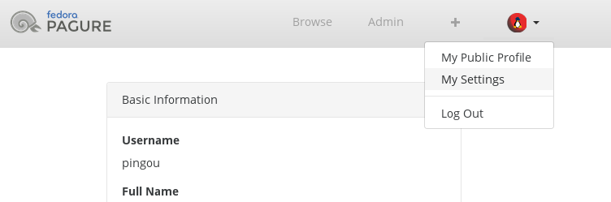
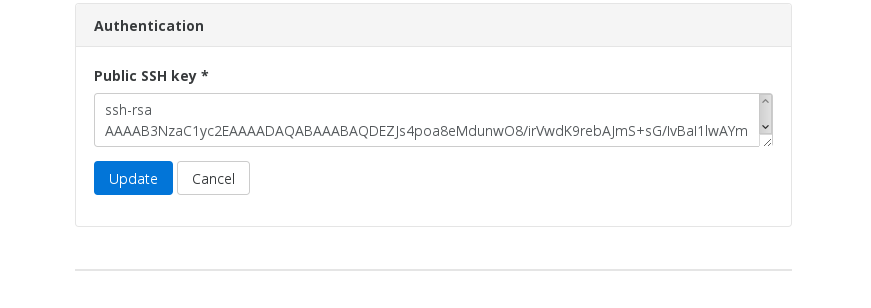

.. _first-steps:

First Steps on pagure
=====================

When coming to pagure for the first time there are a few things one should
do or check to ensure all works as desired.

Login to pagure or create your account
--------------------------------------

Pagure has its own user account system.

For instances of pagure such as the one at `pagure.io <https://pagure.io>`_
where the authentication is delegated to a third party (in the case of
pagure.io, the Fedora Account System) via OpenID, the local user account
is created upon login.

This means, you cannot be added to a group or a project before you login for
the first time as the system will simply not know you.

If you run your own pagure instance which uses the local authentication
system, then you will find on the login page an option to create a new
account.

.. _upload-your-ssh-key:

Upload your SSH key
-------------------

Pagure uses gitolite to manage who has read/write access to which git
repository via `ssh <https://en.wikipedia.org/wiki/Secure_Shell>`_.

An ssh key is composed of two parts:

* a private key, which you must keep to yourself and never share with anyone.
* a public key, which is public and therefore can be shared with anyone.

If you have never generated a ssh key, you can do so by running:

::

    ssh-keygen

or alternatively on GNOME using the application ``seahorse``.

This will create two files in ``~/.ssh/`` (``~`` is the symbol for your home
folder).

These two files will be named (for example) ``id_rsa`` and ``id_rsa.pub``.
The first one is the private key that must never be shared. The second is
the public key that can be uploaded on pagure to give you ssh access.

To upload your public key onto pagure:

1. Login into pagure and click on the user icon on
the top right corner, there, select ``My settings``.

2. In the authentication section of your user settings copy the content of your
``id_rsa.pub`` file in the Public SSH key text box and save your ssh key settings.

.. note:: Pagure support multiple ssh keys per user, to add more than a ssh key
          to your user account just add your new ssh key in your authentication
          settings (one key per row), this way you will be able to push commits
          to your repository from a different computer.

Configure the default email address
-----------------------------------

If the pagure instance you use is using local user authentication, you can
choose whichever email address you prefer to use during account creation.
But in the case (like pagure.io) where the pagure instance relies
on an external authentication service, the email address provided by this
service may be different from the one you prefer.

The settings page of your account (see above for how to access the page)
allows you to add multiple email addresses and set one as default.

Your default email address is the address that will be used to send you
notifications and also as the email address in the git commit if you merge
a pull-request with a merge commit.

For online editing, when doing the commit, you will be presented with the
list of valid email addresses associated with your account and you will be
able to choose which one you wish to use.

.. note:: All email addresses will need to be confirmed to be activated, this
          is done via a link sent by email to the address. If you do not
          receive this link, don't forget to check your spam folder!
