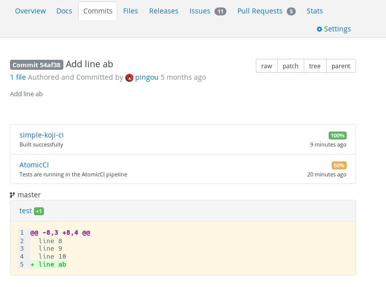
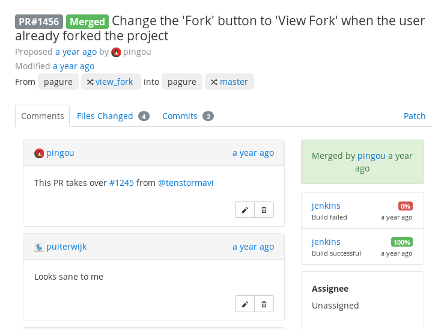

.. _flags:

Flags
=====

Pagure offers the possibility to flag pull-requests and commits. A flag
is a way for a third-party tool to provide feedback on a pull-request or a
commit.

This feedback can be as simple as the outcome of running the tests, or some
lint tool, or test coverage evolution.

Add a flag
----------

Flags can be set via the API, see the ``/api/`` url in your pagure instance
or at `pagure.io/api/ <https://pagure.io/api/0/>`_ and look for the endpoints
with the titles: ``Flag a commit`` or ``Flag a pull-request``.

- **uid**: the API endpoints to add flag have an optional UID argument. It
  is a unique identifier (of maximum 32 characters) that is unique the commit
  or pull-request that is being/has been flagged.
  If it is not specified by the user/tool adding the flag, it will be
  automatically generated and in either case, will be returned in the JSON
  data returned by the API endpoints. Note that this is the only time you
  would be able to retrieve this identifier if you do not specify it
  yourself.

- **status**: this field indicates the status of the task in the system
  running it. Pagure supports the following statuses:

  - ``success``: the task ended successfully.
  - ``canceled``: the task was canceled.
  - ``failure``: the task ended but failed.
  - ``error``: the task did not end at all.
  - ``pending``: the results of this task are pending.
    (for ``failure`` vs ``error`` think of the test system ran the tests but
    they failed vs the test system did not get to run the tests)

- **percent**: this is an optional field which allows to provide some more
  details about the outcome of the task. For example this could be used for
  test coverage, or the number of test that failed/passed.

- **username**: the name of the system running the tests. While not being
  restricted in length, a shorter name will render better in the interface.

- **comment**: a free text form not restricted in length (however, here as
  well if the comment is too long it may render off in the interface).

- **url**: the url the flag is linked to and where the user should be able
  to retrieve more information about the task and its outcome.

.. _example_flag_commit:

Example of two flags on a commit:
---------------------------------

.. _example_flag_pr:

Example of two flags on a pull-request:
---------------------------------------

