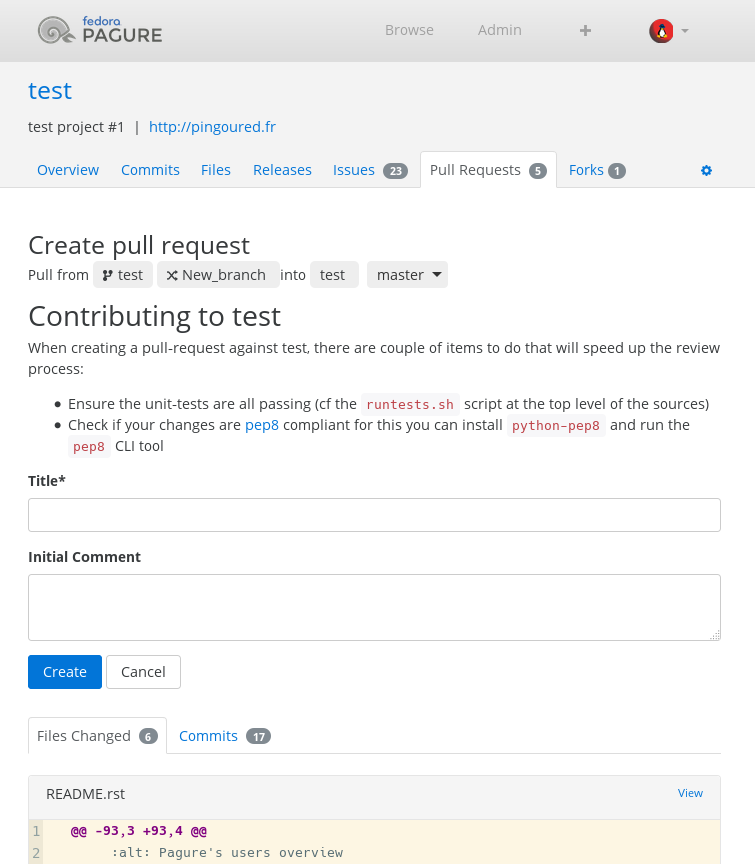

Customize the PR page
=====================

Pagure offers the possibility to customize the page that creates pull-request
to add your specific information, such as: please follow the XYZ coding style,
run the tests or whatever you wish to inform contributors when they open a
new pull-request.

The customization is done via a file in the git repository containing the
meta-data for the pull-requests. This file must be placed under a ``templates``
folder, be named ``contributing.md`` and can be formatted as you wish using
markdown.

Example
-------

For a project named ``test`` on ``pagure.io``.

* First, clone the pull-request git repo [#f1]_ and move into it

::

    git clone ssh://git@pagure.io/requests/test.git
    cd test

* Create the templates folder

::

    mkdir templates

* Create the customized PR info

::

    vim templates/contributing.md

And place in this file the following content:

::

    Contributing to test
    ====================

    When creating a pull-request against test, there are couple of items to do
    that will speed up the review process:

    * Ensure the unit-tests are all passing (cf the ``runtests.sh`` script at the
      top level of the sources)
    * Check if your changes are [pep8](https://www.python.org/dev/peps/pep-0008/)
      compliant for this you can install ``python-pep8`` and run the ``pep8`` CLI
      tool

* Commit and push the changes to the git repo

::

    git add templates
    git commit -m "Customize the PR page"
    git push

* And this is how it will look like

.. [#f1] All the URLs to the different git repositories can be found on the
         main page of the project, on the right-side menu, under the section
         ``Source GIT URLs``, click on ``more`` to see them.
