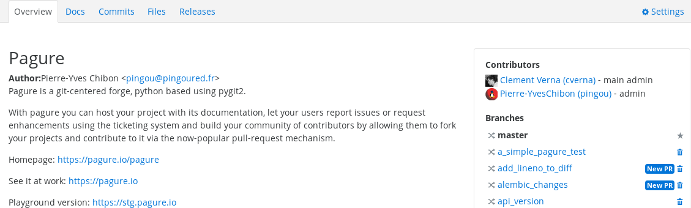
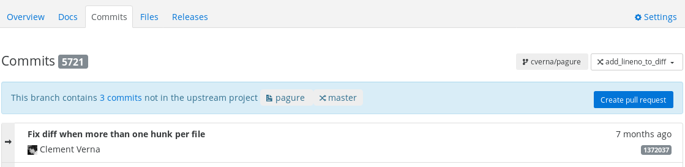
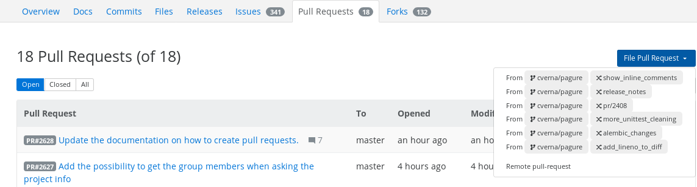

.. _pull-requests:

Pull Requests
=============
Pagure uses the concept of pull requests to contribute changes from your fork
of a project back to the upstream project. To contribute a change to a project
you first open a pull request with original project. The project maintainer
then merges the pull request if they are satisfied with the changes you have
proposed.

.. _open-pull-request:

Open a Pull Request
-------------------
Before you can open a pull request, you need to complete the :ref:`first-steps`
and :ref:`create-fork` of the project you would like to contribute to. Once
you have a fork and you have pushed a `git branch <https://git-scm.com/docs/git-branch>`_
containing one or more `commits <https://git-scm.com/docs/git-commit>`_, you are
ready to contribute to the project.

Pagure to Pagure pull request 
^^^^^^^^^^^^^^^^^^^^^^^^^^^^^

You can create a pull request from a pagure project, using one of the following options

From the project overview 
*************************

#. Go the the ``overview`` tab of your fork.

#. Locate your feature branch (Right hand side), and press the button ``New PR`` button.

#. Fill the Create a pull request form (Title and Description) and create your pull request.

Notes: The ``New PR`` button appears only if there are commits not available in the main branch.

From the commits history 
************************

#. Go to the ``commit`` tab of your fork and select your feature branch.

#. Press the ``create pull request`` button (above the latest commits).

#. Fill the Create a pull request form (Title and Description) and create your pull request.

From the pull requests list
***************************

#. Go to the main project's (not your fork) pull requests list and press the ``File Pull Request`` button.
   
#. Select the feature branch containing your changes from the dropdown menu. 

#. Fill the Create a pull request form (Title and Description) and create your pull request.

 
Remote Git to Pagure pull request 
^^^^^^^^^^^^^^^^^^^^^^^^^^^^^^^^^

You can create a pull request from an other git hosting platform (eg github, gitlab).
This is a remote pull request.

From the pull requests list
***************************

#. Go to the main project's (not your fork) pull requests list and press the ``File Pull Request`` button.
   
#. Select the ``Remote pull-request`` option from the dropdown menu.

#. Fill the New remote pull-request form (Title, Git repo address and Git branch) and create your remote pull request. 

Congratulations! It is now up to the project maintainer to accept your changes
by merging them.

.. _update-pull-request:

Updating Your Pull Request
--------------------------
It is likely that project maintainers will request changes to your proposed code
by commenting on your pull request. Don't be discouraged! This is an opportunity
to improve your contribution and for both reviewer and reviewee to become better
programmers.

Adding to your pull request is as simple as pushing new commits to the branch you
used to create the pull request. These will automatically be displayed in the
commit list for the pull request.

Rebasing
^^^^^^^^
You may encounter a situation where you want to include changes from the master
branch that were made after you created your pull request. You can do this by
`rebasing <https://git-scm.com/docs/git-rebase>`_ your pull request branch and
pushing it to your remote fork.

.. _working-with-prs:

Working with Pull Requests
--------------------------
It's quite common to work with a pull request locally, either to build on top of
it or to test it. You can do this by editing your git configuration as follow.
Locate your remote in the ``.git/config`` file, for example: ::

    [remote "upstream"]
        url = ssh://git@pagure.io/pagure.git
	fetch = +refs/heads/*:refs/remotes/upstream/*

Now add the line ``fetch = +refs/pull/*/head:refs/remotes/upstream/pr/*`` to this section. ::

    [remote "upstream"]
        url = ssh://git@pagure.io/pagure.git
	fetch = +refs/heads/*:refs/remotes/upstream/*
        fetch = +refs/pull/*/head:refs/remotes/upstream/pr/*

Obviously, the remote url should be matching the url of your project (pagure project in
this example).

Now you can fetch the all the pull requests: ::

    $ git fetch upstream
    From ssh://pagure.io/pagure
    * [new ref]        refs/pull/2541/head -> upstream/pr/2541
    * [new ref]        refs/pull/2540/head -> upstream/pr/2540
    * [new ref]        refs/pull/2538/head -> upstream/pr/2538

To checkout a particular pull request: ::

    $ git checkout pr/25413
    Branch pr/2541 set up to track remote branch pr/2541 from upstream.
    Switched to a new branch 'pr/2541'

You will now be able to use this branch to work from or on this pull requests.

If you are only interested in one particular pull request and do not want to fetch all the project PRs,
you can add to your ``~/.bashrc`` the following function: ::

    function pullpr {
        remote="${2:-upstream}"
        git fetch $remote pull/$1/head:pr_$1
        git checkout pr_$1
    }

Then after sourcing your ``~/.bashrc`` or restarting your shell, you can use the
pullpr function to checkout a pull request from within the clone of the git repository.
For example checkout pull request number 58 from current git clone (here the
infra-docs project) ::

    $ source ~/.bashrc
    $ pullpr 58
    remote: Counting objects: 393, done.
    remote: Compressing objects: 100% (238/238), done.
    remote: Total 365 (delta 231), reused 255 (delta 127)
    Receiving objects: 100% (365/365), 71.36 KiB | 63.00 KiB/s, done.
    Resolving deltas: 100% (231/231), completed with 20 local objects.
    From ssh://pagure.io/infra-docs
    * [new ref]         refs/pull/58/head -> pr_58
    Switched to branch 'pr_58'
