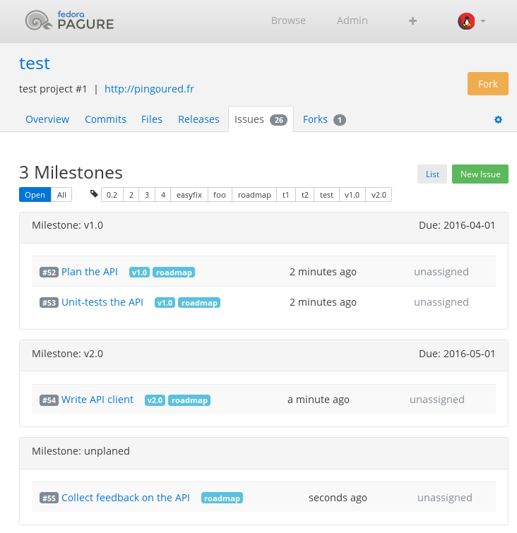

Using the roadmap feature
=========================

Pagure allows building the roadmap of the project using the tickets and
their milestones.

The principal is as follow:

* For each milestones defined in the settings of the project, the roadmap
  will group tickets with the corresponding milestone.

* If your project has an ``unplanned`` milestone, this milestone will be
  shown at the bottom of the roadmap page. This allowing you to put something
  on the roadmap without assigning a real milestone to it.

Example
-------

For a project named ``test`` on ``pagure.io``.

* First, go to the settings page of the project, create the milestones you
  like, for example: ``v1.0`` and ``v2.0``.

* For the tickets you want to be on these milestones, go through each of them
  and set their milestone to either ``v1.0`` or ``v2.0``, or none of them
  if the ticket is not on the roadmap.
  You can set the milestone on the metadata panel on the right side of the
  issue page.

* And this is how it will look like

