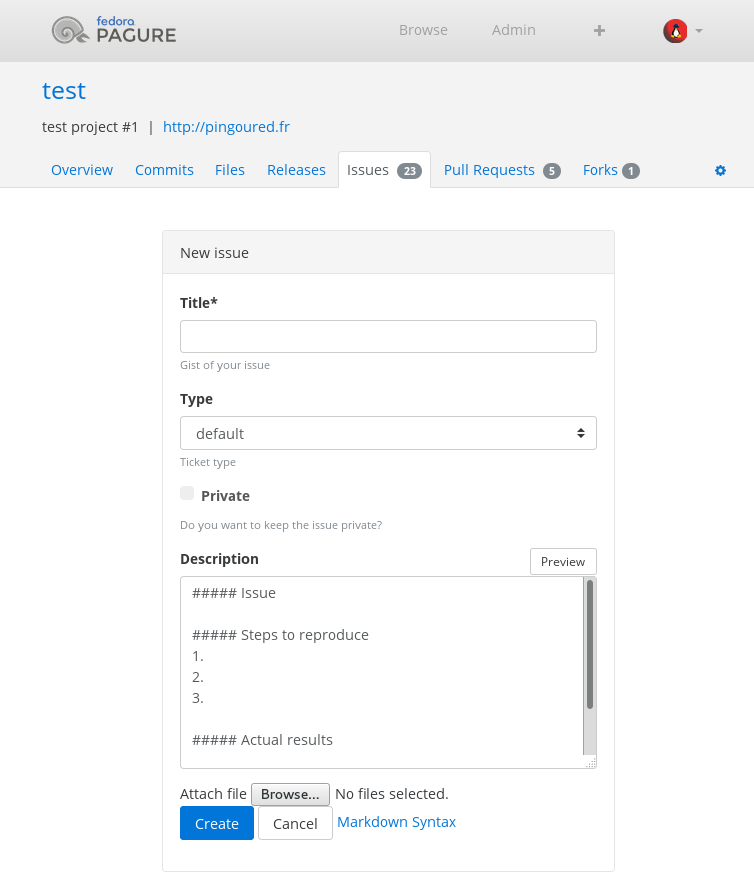

Templates for ticket input
==========================

Pagure offers the possibility to add templates for ticket's input. These
templates do not enforce anything, users will have the possibility to simply
ignore it, or even to not follow it, but it also helps structuring the
ticket opened against a project and highlighting the information that are
often requested/needed.

The templates are provided in the git repository containing the meta-data
for the tickets.
They must be placed under a ``templates`` folder in this git repository,
end with ``.md`` and as the extension suggests can be formatted as markdown.

If you create a template ``templates/default.md``, it will be shown by
default when someone ask to create a new ticket.

Example
-------

For a project named ``test`` on ``pagure.io``.

* First, clone the ticket git repo [#f1]_ and move into it

::

    git clone ssh://git@pagure.io/tickets/test.git
    cd test

* Create the templates folder

::

    mkdir templates

* Create a default template

::

    vim templates/default.md

And place in this file the following content:

::

    ##### Issue

    ##### Steps to reproduce
    1.
    2.
    3.

    ##### Actual results

    ##### Expected results

* Commit and push the changes to the git repo

::

    git add templates
    git commit -m "Add a default template for tickets"
    git push

* And this is how it will look like

.. [#f1] The URLs to the different git repositories can be found on the
         main page of the project, on the right-side menu, under the section
         ``Source GIT URLs``. Click on ``more`` to see them if you are logged
         in and have access to the repository (the ticket and request git
         repositories require a `commit` access or higher).
