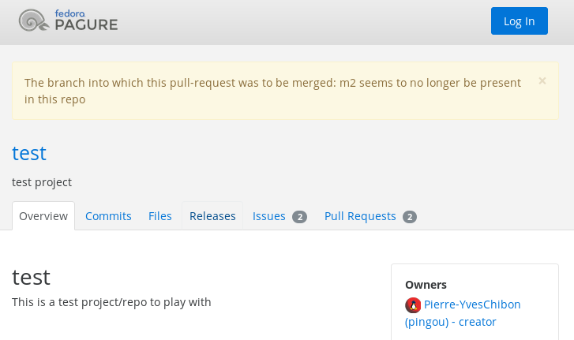

Inaccessible pull-requests
==========================

The symptoms
------------

When trying to open a pull-request, if you run into this error:

::

    The branch into which this pull-request was to be merged: XXX seems to
    no longer be present in this repo

(Where ``XXX`` is a branch name).

(Here ``XXX`` is ``m2``).

This means that the pull-request was opened against a branch on your repo and
that this branch no longer exists.
Pagure is therefore unable to compute the diff between the sources and
the target of the pull-request.

The pull-request is thus inaccessible but remains in the list of open
pull-requests.

The solution
------------

The easiest solution to solve this problem is to re-create the target branch
in your repo.

This can be done using git simply by doing:

::

    git checkout -b <branch_name>
    git push origin <branch_name>

It will create the branch named ``<branch_name>`` in Pagure, allowing the
diff to be computed for that pull-request and thus allowing it to be
displayed. It is then up to you to see if this pull-request is still relevant
and should be merged or closed.
